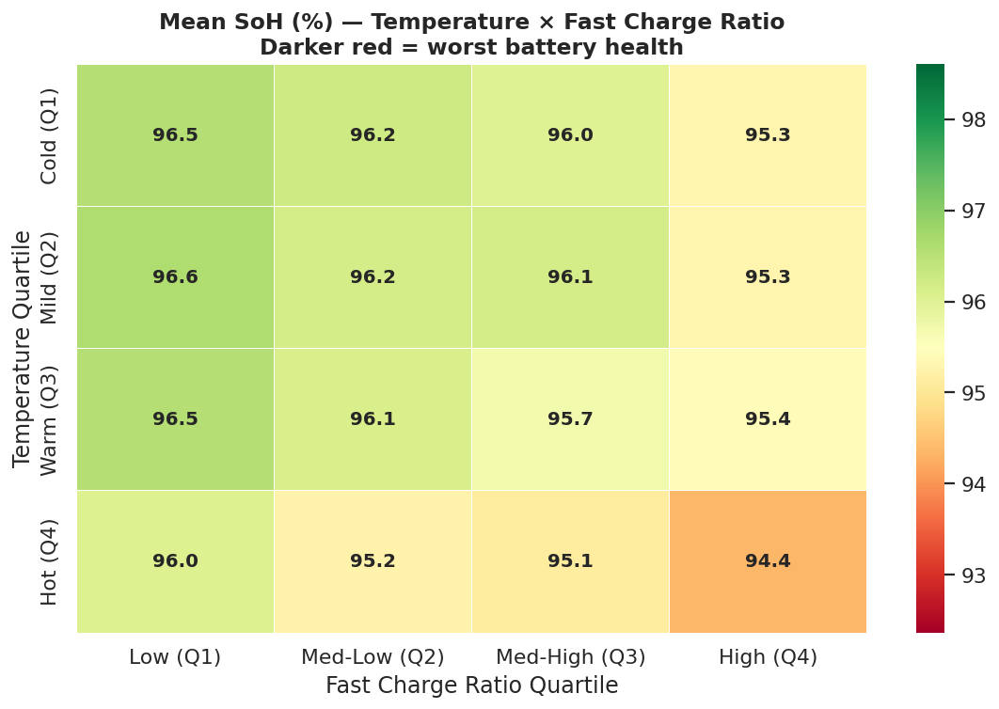

# EV Battery Degradation — Exploratory Data Analysis


An end-to-end EDA exploring what causes EV battery health (SoH) to decline — covering charging behavior, temperature, driving style, and internal resistance across multiple vehicle models and battery types.

> **Note:** This dataset is synthetically generated. The analysis demonstrates EDA methodology and statistical reasoning — findings are consistent with real-world battery research but are not empirical conclusions.

---

## Key Findings

| Factor | Correlation with SoH | Interpretation |
|---|---|---|
| Internal Resistance | r = −0.87 | Strongest predictor of degradation |
| Fast Charge Ratio | r = −0.71 | Frequent fast charging accelerates decline |
| Avg Temperature | r = −0.58 | High heat worsens long-term health |
| Charging Cycles | r = −0.64 | More cycles = lower SoH (expected) |
| Anomaly rate | ~4.8% | Vehicles degrading faster than cycle count predicts |

**The worst combination:** High fast-charge ratio + high operating temperature consistently produced the lowest SoH values across all battery types.



---

## Analysis Structure

The notebook is organized into 4 tracks:

1. **Track 1 — Core Story**: SoH distribution, degradation over cycles, battery status breakdown
2. **Track 2 — Driver Analysis**: Correlation heatmap, scatter plots, temperature bins, driving style
3. **Track 3 — Segmentation**: SoH by battery type, car model ranking, vehicle age groups
4. **Track 4 — Engineering Signal**: Internal resistance, anomaly detection, worst-combination heatmap

---

## Project Structure

```
ev-battery-eda/
├── notebook/
│   └── ev_battery_eda.ipynb     ← main analysis notebook
├── images/
│   ├── track1_core_story.png
│   ├── track2_correlation_heatmap.png
│   ├── track2_driver_scatters.png
│   ├── track2_temp_boxplot.png
│   ├── track2_driving_style_violin.png
│   ├── track3_segmentation.png
│   ├── track3_age_soh.png
│   ├── track4_engineering_signal.png
│   └── track4_worst_combination.png
├── data/
│   └── README.md                ← dataset source & disclosure
├── requirements.txt
└── README.md
```

---

## Tech Stack

- **Language**: Python 3.10
- **Data wrangling**: Pandas, NumPy
- **Visualization**: Seaborn, Matplotlib
- **Statistics**: SciPy (Pearson correlation, linear regression)
- **Environment**: Jupyter Notebook

---

## How to Run

```bash
git clone https://github.com/yourusername/ev-battery-eda
cd ev-battery-eda
pip install -r requirements.txt
jupyter notebook notebook/ev_battery_eda.ipynb
```

---

## Japanese Summary｜日本語概要

本プロジェクトでは、電気自動車（EV）のバッテリー劣化データを用いて探索的データ分析（EDA）を実施しました。急速充電の頻度・高温環境・積極的な運転スタイルがバッテリー健全性（SoH）に与える影響を定量的に分析し、信頼性工学の観点から考察しています。日本のカーボンニュートラル政策（2050年目標）の文脈においても、EVバッテリーの長寿命化は重要な課題です。

---

## About the Author

Cloud Engineer Apprentice | AWS Certified Solutions Architect (Associate) + Cloud Practitioner  
Open to data engineering and cloud roles in Japan 🇯🇵  
[LinkedIn](#) · [Kaggle](#)
